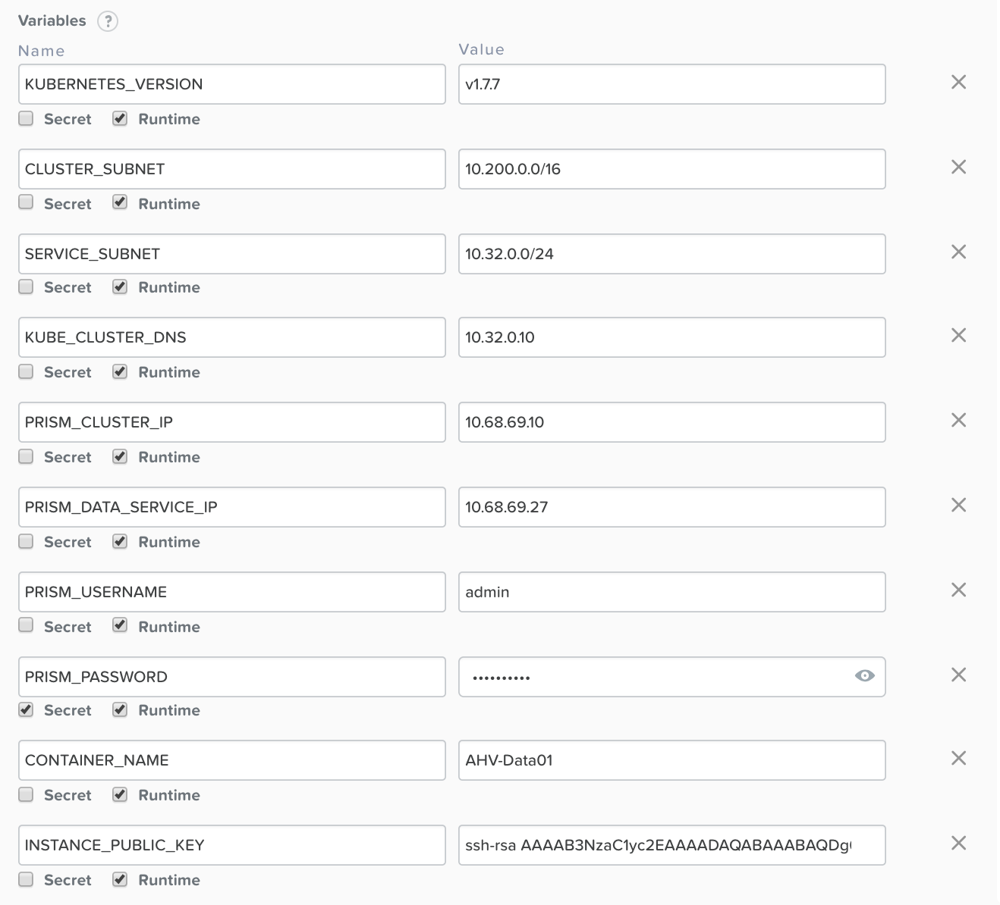
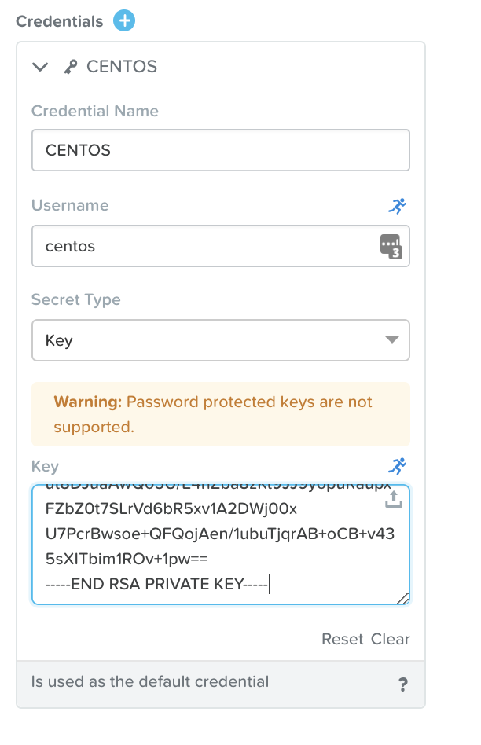
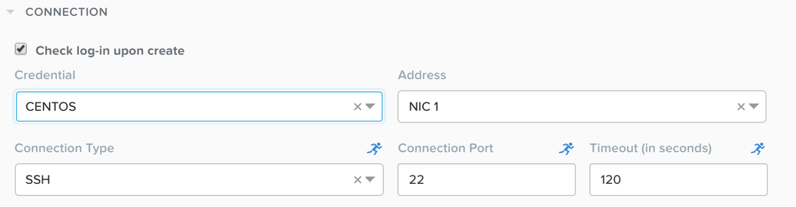
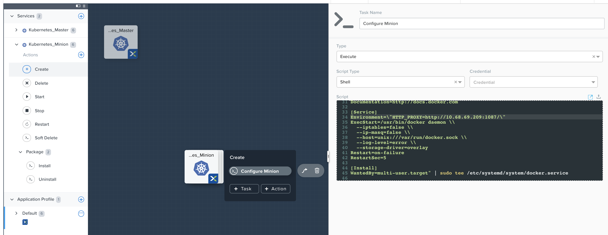

.. _calm_kubernetes_blueprint:

----------------
Calm: Kubernetes
----------------

Using Kubernetes BP v2.0.0
++++++++++++++++++++++++++

- Clone k8s 2.0 blueprint to your project

- Update variables
    .. list-table::
        :widths: 30 40
        :header-rows: 1 

        *   - Name
            - Value
        *   - KUBE_CLUSTER_NAME
            - ``kube-calm``
        *   - KUBE_IMAGE_TAG
            - ``v1.10.5_coreos.0``
        *   - DOCKER_VERSION
            - ``17.03.2.ce``
        *   - KUBE_CLUSTER_SUBNET
            - ``10.200.0.0/16``
        *   - KUBE_SERVICE_SUBNET
            - ``10.32.0.0/24``
        *   - KUBE_DNS_IP
            - ``10.32.0.10``
        *   - PE_CLUSTER_IP
            - ``10.132.68.55``, based on your env
        *   - PE_DATA_SERVICE_IP
            - ``10.132.68.56``, based on your env
        *   - PE_USERNAME
            - ``admin``, based on your env
        *   - PE_PASSWORD
            - ``***``, based on your env
        *   - PE_CONTAINER_NAME
            - ``SelfServiceContainer``
        *   - INSTANCE_PUBLIC_KEY
            - ``***``, based on your key

- update credentials
    .. image:: images/kube-1.10.5-01.png
        :width: 50 %

- customized vm image based on default image (http://download.nutanix.com/calm/CentOS-7-x86_64-GenericCloud.qcow2)
    - download some package to /home/centos (sample), due to network limitation in some region
        .. code-block:: bash

            #part1
            ETCD_VERSION="v3.2.24"
            KUBE_IMAGE_TAG="v1.10.5_coreos.0"
            VERSION=$(echo "${KUBELET_IMAGE_TAG}" | tr "_" " " | awk '{print $1}')
            wget -q "https://github.com/coreos/etcd/releases/download/${ETCD_VERSION}/etcd-${ETCD_VERSION}-linux-amd64.tar.gz"
            wget -q https://github.com/containernetworking/plugins/releases/download/v0.6.0/cni-plugins-amd64-v0.6.0.tgz
            wget -q https://storage.googleapis.com/kubernetes-release/release/${VERSION}/bin/linux/amd64/kubelet
            #part2
            wget -q https://pkg.cfssl.org/R1.2/cfssl_linux-amd64 https://pkg.cfssl.org/R1.2/cfssljson_linux-amd64
            wget -q https://storage.googleapis.com/kubernetes-release/release/${VERSION}/bin/linux/amd64/kubectl
            wget -q "https://storage.googleapis.com/kubernetes-helm/helm-v2.8.2-linux-amd64.tar.gz"

    - yum update
        .. code-block:: bash

            yum -y update

    - clean vm
        - remove MAC entry in /etc/sysconfig/network-scripts/ifcfg-eth0
        - cp /dev/null /etc/udev/rules.d/70-persistent-net.rules
    
    - create image from this vm
        - using ``acli vm.get vm_name`` to get vmdisk uuid of scsi 0
        - confirm file existed `` nfs_ls -l /SelfServiceContainer/.acropolis/vmdisk/vmdisk_uuid ``
        - login to PC - explorer - image - add image - url: ``nfs://cvm_ip//SelfServiceContainer/.acropolis/vmdisk/vmdisk_uuid``
        - input image name as you needed

- comment lines in 'package install' task (master & minion), because we have download it before
    - on master - part1
        .. image:: images/kube-1.10.5-02.png

    - on master - part2, helm version is ``2.8.2``
        .. image:: images/kube-1.10.5-03.png

    - on minion
        .. image:: images/kube-1.10.5-04.png

- add environemnt to docker service (master & minion), my proxy ip address is ``10.132.71.38``
    .. code-block:: bash

        sudo sed -i '/ExecStart=/c\\ExecStart=/usr/bin/dockerd -H tcp://0.0.0.0:2375 -H unix:///var/run/docker.sock' /usr/lib/systemd/system/docker.service
        #add following lines
        cp /usr/lib/systemd/system/docker.service /tmp
        sudo sed -i '/\[Service\]/c\\[Service]\nEnvironment=\"HTTP_PROXY=http://10.132.71.38:1080/\"' /usr/lib/systemd/system/docker.service

    .. figure:: images/kube-1.10.5-05.png

- update vm image & cpu/memory (master & minion)
    .. figure:: images/kube-1.10.5-06.png
        :width: 50 %

- update vm nic (master & minion)
    .. figure:: images/kube-1.10.5-07.png
        :width: 50 %

- add more waiting time (line 22: change ``5`` to ``15``), due to download through proxy is slower than normal.
    .. figure:: images/kube-1.10.5-08.png

- update HELM script, add using http proxy (10.132.71.38) when helm init
    .. code-block:: bash

        printf -v no_proxy '%s,' 10.132.249.{1..255}
        export no_proxy=${no_proxy}localhost
        echo $no_proxy
        http_proxy=http://10.132.71.38:1080/ no_proxy=${no_proxy} helm init --service-account helm

    .. figure:: images/kube-1.10.5-09.png

- login to controller0 to execute ``kubectl get no``

download blueprint :download:`HERE <./k8s-bp-2.0.json>`

Using Kubernetes BP v1.0.0
++++++++++++++++++++++++++

Variables
.........

Clone kubernetes blueprint v1.0.0 from market place to your project, 
edit variables to suite your environment.

    - CLUSTER_SUBNET -- pod network in kubernetes
    - SERVICE_SUBNET -- service network in kubernetes
    - KUBE_CLUSTER_DNS -- leave it default
    - PRISM_CLUSTER_IP / PRISM_DATA_SERVICE_IP -- nutanix cluster info
    - PRISM_USERNAME / PRISM_PASSWORD -- credentials for nutanix prism
    - CONTAINER_NAME -- where your VMs will located in
    - INSTANCE_PUBLIC_KEY -- public key for user who will login VM to execute all tasks

Credentials
...........

Edit default user, add private key to CENTOS.
This user will be created with cloud-init script and transfer public key to authorized_keys file (see images above)
you need put the private key in here (see image below) 

Service
.......

this image is based on default nutanix image (http://download.nutanix.com/calm/CentOS-7-x86_64-GenericCloud.qcow2). 
I just download some packages i needed first due to network issue in China.

.. figure:: images/kube-1.7.7-3.png
    :width: 70 %

Choose a network with IPAM enabled or has DHCP server in that segment

.. figure:: images/kube-1.7.7-4.png
    :width: 70 %

Choose default user for login check-in

Task
....

Edit task in minion (K8SM)

- comment all wget packages due to we have download them in advance

- add environment to docker system script, to ensure download images through proxy, especially when your demo environment in C_H_I_N_A

.. code-block:: bash

    Environment=\"HTTP_PROXY=http://10.132.71.38:1080/\"

Edit task in controller (K8SC)

- comment all wget packages due to we have download them in advance

Other
.....

.. figure:: images/kube-1.7.7-7.png

Launch
......

.. figure:: images/kube-1.7.7-8.png

